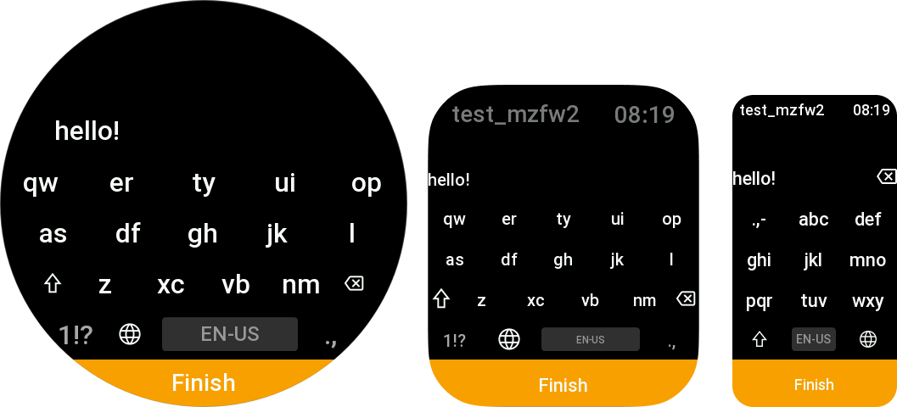

import Tabs from '@theme/Tabs';
import TabItem from '@theme/TabItem';

# Keyboard
> Class: `ScreenBoard`.

Adaptive on-screen keyboard with a couple of supported languages.


<Tabs>
    <TabItem value="one" label="Simple example" default>
```javascript title="page/index.js" showLineNumbers
import { ScreenBoard } from "mzfw/device/ScreenBoard";

Page({
    build() {
        // highlight-start
        const board = new ScreenBoard({});
        board.onConfirm = (value) => {
            console.log("confirm clicked:", value);
        };
        board.visible = true;
        // highlight-end
    }
})

```
    </TabItem>
    <TabItem value="two" label="From screenshot" default>
```javascript title="page/index.js" showLineNumbers
import { ScreenBoard } from "mzfw/device/ScreenBoard";
import { UiTheme } from "mzfw/device/UiCompositor"

// Custom theme for keyboard
class MyTheme extends UiTheme {
    ACCENT_COLOR_DARK = 0xFFA000;
}

Page({
    build() {
        // Create keyboard with custom theme
        const board = new ScreenBoard({
            theme: new MyTheme(),
        });

        // Keyboard options
        board.title = "Test keyboard";
        board.confirmButtonText = "Finish";

        // Value managment
        board.value = "hello!";
        board.onConfirm = (value) => {
            console.log("confirm clicked:", value);
        };

        // Show keyboard now
        board.visible = true;
    }
})

```
    </TabItem>
</Tabs>

## Compatibility
All ZeppOS devices are supported.

## Features
- Three layouts: `T9`, `T14` and `QWERTY`;
- Multiple language support;
- Can be used within compositor or without;
- Built-in [settings screen](./settings);
- Theming support (see [device theming guideline](/docs/device/theming)).

## Reference
### `new ScreenBoard(options)`

Create a new ScreenBoard instance with provided options.

`options` is an object that may contain following properties:
- `theme: UiTheme`: theme that will be used for keyboard design & sizing;
- `forceRenderer: string`: force set renderer ID, may be `t9`, `t14` or `qwerty`;
- `forceLayouts: string[]`: force set keyboard layout IDs.

### `title: string`
Property. Text that will be displayed when `value` is empty.

### `confirmButtonText: string`
Property. Text shown on confirm button bellow the keyboard.

### `visible: boolean`
Property. If set to `true`, keyboard will be rendered and shown. If `false`
(default), it will be hidden

### `value: string`
Property. Current keyboard screen value.

### `onConfirm(value: string): any`
Method. Will be called when user click to confirm button bellow the keyboard.
Can be overridden.
