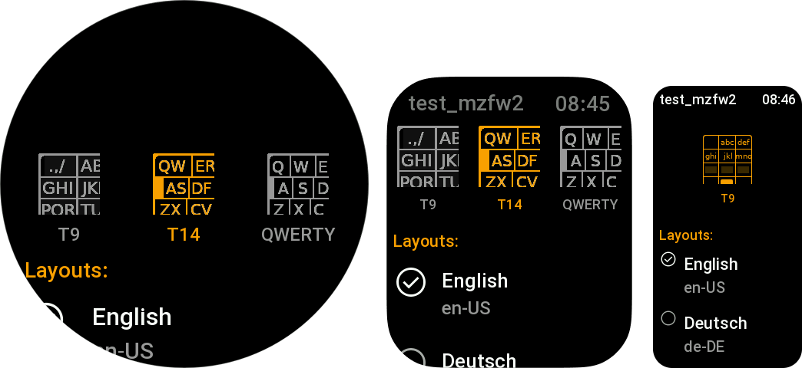

import Tabs from "@theme/Tabs";
import TabItem from "@theme/TabItem";

# Settings screen
> Class: `ScreenBoardConfigScreen`.

Prebuilt configuration screen for ScreenBoard.


<Tabs>
    <TabItem value="simple" label="Simple example" default>
```javascript title="page/KeybaordSettingsScreen.js" showLineNumbers
import { ScreenBoardConfigScreen } from "mzfw/device/ScreenBoardConfigScreen";
Page(ScreenBoardConfigScreen.makePage(new ScreenBoardConfigScreen({})))
```
    </TabItem>
    <TabItem value="adv" label="Advanced example">
```javascript title="page/KeybaordSettingsScreen.js" showLineNumbers
import { ScreenBoardConfigScreen } from "mzfw/device/ScreenBoardConfigScreen";
import { UiTheme } from "mzfw/device/UiCompositor"

// Custom theme for keyboard settings
class MyTheme extends UiTheme {
  ACCENT_COLOR = 0xFFA000;
}

class MyScreen extends ScreenBoardConfigScreen {
  theme = new MyTheme();

  i18n(key) {
    // This method will be called for each displayed string.
    // You can use it to apply translations for some strings
    // on display. In simplest case:
    const myLocale = {
      "Layouts:": "Языки:",
    }

    // Return translated string, or if not exists, original one
    return myLocale[key] ?? key;
  }
}

Page(MyScreen.makePage(new MyScreen({})))
```
    </TabItem>
</Tabs>

