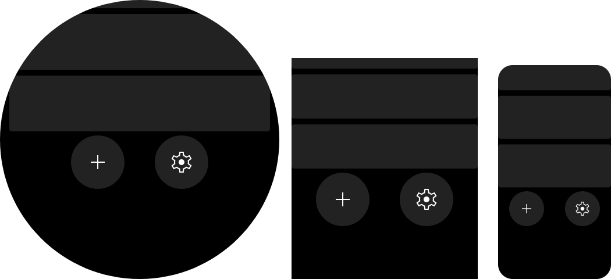

# Action bar
> Class: `ActionBar`.

This component provides set of icon buttons. Each button have their icon & click handler.

Component can be focused  by wheel scroll, it will switch between buttons inside with  them and call `onClock` on wheel short click.


```javascript title="page/index.js"
import { ListView } from "mzfw/device/UiListView";
import { ActionBar } from "mzfw/device/UiActionBar";
import { spawnPlaceholders } from "mzfw/device/DocumentationDemos";

class MyPage extends ListView {
  build() {
    return [
      // Some grey squares, for preview
      ...spawnPlaceholders(),

      // Action bar and their items
      new ActionBar({
	    children: [
	      {
	        icon: "add",
	        onClick: () => console.log("onAdd"),
	      },
	      {
	        icon: "settings",
	        onClick: () => console.log("onSettings"),
	      },
	    ]
      }),
    ];
  }
}

Page(ListView.makePage(new MyPage({})));
```

## Use cases

Component is designed to be used as action or tool bar, located at top or at bottom of page, not as header/footer. Recommended count of buttons is 1-2, but it can contain any count of them — buttons will be placed in multiple rows.

## Design & layout

Buttons will be listed from left to right, if not fit into component width – in  multiple rows. Background colors can be provided in properties, if not provided — them will be loaded from compositor’s theme.

Required  icon sizes:

| Icon size | Device model(s)   |
| --------- |-------------------|
| 48 px     | All devices       |

Items also can be disabled, which will make it opaque, prevent their focus with wheel and disable `onClick` handler.

##  Compatibility

No issues or limitations known.

## Properties

### `children: ActionBarItem[]`

Button children descriptions.

`ActionBarItem` interface:
- `icon: string` –  Icon file name without extension,  should be saved in app assets: `$ASSETS/icon/$ICON_SIZE/$NAME.png`;
- `disabled?: boolean` — is item disabled, `false` by default;
- `onClick(): any` — item click handler.

### `backgroundNormal?: number`

Normal button background color. Optional.

### `backgroundSelected?: number`

Selected button background color. Optional.

### `backgroundDisabled?: number`

Disabled button background color. Optional.
