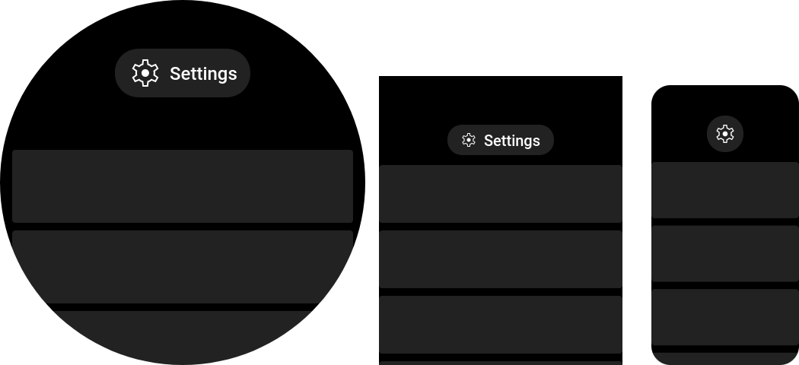

# Headline button

> Class: `HeadlineButton`

This component provides a small button with width-depending design. It contain icon and title, which will be visible only if there’s enough space on screen.

Component can be focused by wheel, their click will call `onClick()` callback.



```javascript title="page/index.js"
import { ListView } from "mzfw/device/UiListView";
import { HeadlineButton } from "mzfw/device/UiButton";
import { spawnPlaceholders } from "mzfw/device/DocumentationDemos";

// NOTE: That's import for zeusx. If you're writing for zeus, use instead
// const { align } = hmUI;
import { align } from "@zosx/ui";

class MyPage extends ListView {
  buildHeader() {
    // Headline button
    return new HeadlineButton({
      text: "Settings",
      icon: "settings",
      onClick: () => {
        console.log("onSettings");
      }
    });
  }

  build() {
    return [
      // Grey rectangles, for preview
      ...spawnPlaceholders(5),
    ];
  }
}

Page(ListView.makePage(new MyPage({})));
```

## Use cases

This component is designed to be used in header and/or footer of [ListView](../compositors/ListView) compositor. It can be used to provide out-of-context page action, example to open “About this app” or settings dialog.

## Design and layout

This component has three layouts:
- Icon button without title for screen smaller than 200 px;
- Small icon and title for screen smaller than 380 px;
- Large icon and title for large screens.

Used in this component icon should be available in following sizes:

| Icon  size | Device model(s)                                                |
| ---------- |----------------------------------------------------------------|
| 32 px      | GTS 4 Mini, Bip 5 and other with `IS_SMALL_SCREEN_DEVICE` flag |
| 48 px      | Band 7, Mi Band 7 and all other devices                        |

## Compatibility

No issues or limitations found.

## Properties

### `text: string`

Button text, visible on large screens.

### `icon: string`

Icon file name without extension. Icon should be located in app assets: `$ASSETS/icon/$ICON_SIZE/$NAME.png`.

### `onClick?(): any`

Button on click handler. Optional.

### `textColor?: number`

Button text color. Optional, default loaded from theme `BUTTON_TEXT`.

### `backgroundNormal?: number`

Normal button background color.  Optional, default load from theme `BUTTON_NORMAL`.

### `backgroundSelected?: number`

Selected button background color.  Optional, default load from theme `BUTTON_SELECTED`.

### `backgroundPressed?: number`

Pressed button background color.  Optional, default load from theme `BUTTON_PRESSED`.
