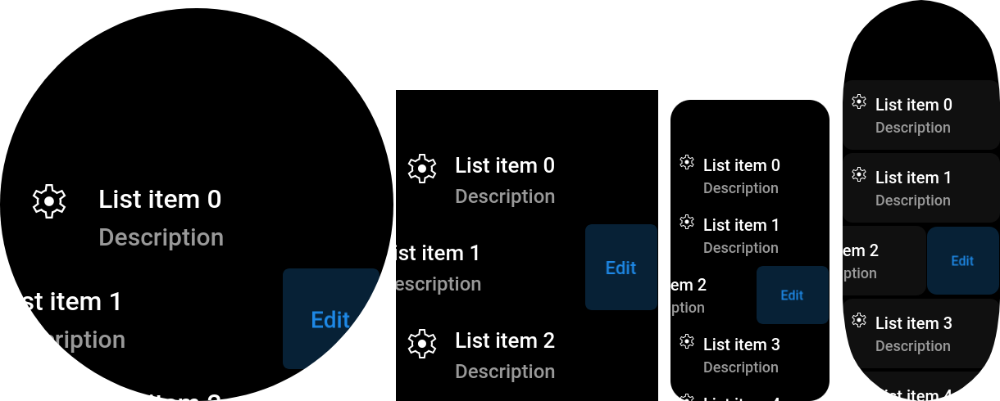

# List item

> Class: `ListItem`

This component provides common list item view. It is a clickable row 
with title, description and icon (all optional). Based on 
[Paper component](./PaperComponent), so you can use their extra features, 
including [extra button](./PaperComponent#Properties).

This item can be selected & clicked via spin wheel. Short wheel click 
will call `onClick()`, long — `onSecondActionClick()`.



```javascript title="page/index.js"
import { ListView, ListItem } from "mzfw/device/UiListView";

class MyPage extends ListView {
  build() {
    // Generate a set of 6 ListItem's
    const out = [];

    for(let i = 0; i < 6; i++) {
      out.push(new ListItem({
        // Visible properties
        title: `List item ${i}`,
        description: "Description",
        icon: "settings",

        // Second action button
        secondActionName: "Edit",
        onSecondActionClick: () => {
          console.log(`onEdit`);
        },

        // Click handler
        onClick: () => {
          console.log("onClick");
        },
      }))
    }

    return out;
  }
}

Page(ListView.makePage(new MyPage({})));
```

## Use cases

Designed to be used in [ListView](../compositors/ListView) compositor. This component is designed to be used as an entry in any list of data entities, or in app settings.  But you can also use it as an advanced button, or as visible part of input/select field.

## Design & layout

Background is inherited from Paper component, and in default settings is black for Amazfit devices, and grey for Mi Band 7. Text & background colors by default are nested from [compositor's theme](../theming), and can be overridden in properties. Font size is also read from theme, for description it will be less by `2px`.

Icon used in this component should be available in following sizes:

| Icon size | Device model                            |
| --------- | --------------------------------------- |
| 24 px     | Amazfit Band 7, Mi Band 7               |
| 48 px     | Other devices with `SCREEN_WIDTH < 380` |
| 56 px     | Other devices                           |

By default, item icon is located at left of title & description, but you can move it to right via `iconPosition` property. Automatic component height equals to full height of component contents with extra padding

## Compatibility

- This component can’t be destroyed in Amazfit Band 7, Mi Band 7, due to their ZeppOS implementation bugs.

## Properties

### `title?: string`

List item title, by default, displayed as first text row in component. Optional.

### `icon?: string`

Icon file name without extension. Icon should be located in app assets: `$ASSETS/icon/$ICON_SIZE/$NAME.png`. Optional.

### `description?: string`

List item description text, by default, placed bellow `title`. Optional.

### `iconPosition?: "left"|"right"`

Where to place icon: at left or right from text. Optional, default to `"left"`.

###  `titleColor?: string`

Item title color. Optional, by default will be loaded from compositor's theme.

### `descriptionColor?: string`

Item description text color. Optional, by default will be loaded from compositor's theme.

###  `onClick()?: any`

Item click callback, will be called on short paper click.

## Inherited properties

### `paperRadius?: number`

Background round radius.Optional, default to built-in `ListItem` style.

### `secondActionName?: string`

Hidden button text, see paper component guide.Optional.

### `onSecondActionClick()?: any`

Hidden button click &  wheel long click callback. Optional.

###  `paperBackgroundNormal?: number`

Normal background color. Optional, default  loaded from theme.

### `paperBackgroundSelected?: number`

Selected (by wheel) background color. Optional, default  loaded from theme.

### `paperBackgroundPressed?: number`

Pressed background color. Optional, default  loaded from theme.

### `paperBackgroundMarginH?: number`

Extra horizonal margin for component.

### `paperBackgroundMarginV?: number`

Extra vertical margin for component.
