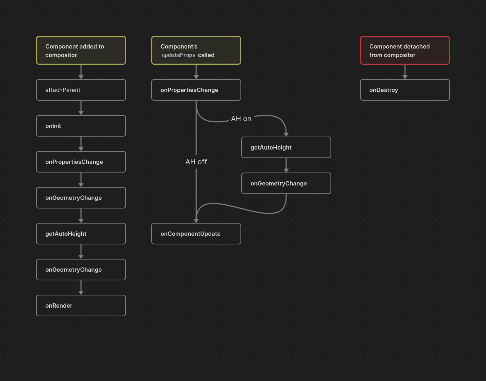

# Components

Main part of `mzfw`'s UI library is an component. Each component provides
one complete part of user interface, for example, a button, list item, 
action bar, text entry or anything other.

## Component lifecycle.

- **Component created**: This stage reaches when you call their
  constructor, eg `new TextComponent({...})`. This call didnt
  run anything except than component's constructor;
- **Component attached to compositor**: This stage reaches when 
  compositor above this component start their initialization
  and render. This will call most lifecycle events inside
  component to perform an initialization;
- **Component update**: This stage will be reached when
  you or compositor will perform component's properties
  change;
- **Component destroyed**: This stage will be reached when
  compositor tries to delete this component, or when user
  leave page where component is located.



<details>
<summary>Example: updating component after their attachment</summary>
```javascript title="page/index.js"
import { ListView, ListItem } from "mzfw/device/UiListView";

class MyPage extends ListView {
  constructor() {
    super(...arguments);

    // Create a new ListItem
    // This will reach first lifecycle stage
    this.balanceItem = new ListItem({
      title: "Your balance",
      description: "Loading...",
    });
  }

  build() {
    /**
     * ListView will automatically attach and 
     * render all components that are returned
     * from `build()`. so after this component
     * will react stage 2 (attached).
     */
    return [
      this.balanceItem,
    ];
  }

  onBuild() {
    /**
     * Requires mzfw 0.3.0+, in older versions
     * you can place post-render events directly
     * into `performRender()`, don't forgot to
     * call super method in that case.
     * 
     * We'll perform a network request. To use
     * `fetch` in your code, set up fetch forwarding
     * according to documentation. Or use side-service
     * messaging directly.
     */
    fetch("https://mzfw.mmk.pw/demo_balance.json").then((d) => {
      return d.json();
    }).then((r) => {
      // We'll change description of our ListItem.
      // This will be a trigger for third lifecycle
      // stage: component update
      this.balanceItem.updateProps({
        description: `Current: $${r.balance}`,
      })
    })
  }
}


Page(ListView.makePage(new MyPage({})));
```
</details>

## Component reference

Following methods and properties are available for any component.

> `isRendered: boolean`

Property, readonly. Will be `true` if component is rendered in compositor.

> `isFocusable: boolean`

Property, readonly. Will be `true` if component can be focused via buttons
/wheel spin.

> `geometry: ComponentGeometry`

Property, readonly. Current component geometry, should be an object with `x`, `y`, `w`, `h`
properties, which could be numbers or null.

> `updateProps(newProps: Partial<P>)`

Method. Override all or some properties in component.

> `setGeometry(x: number|null, y: number|null, w: number|null, h: number|null)`

Method. Will modify current component geometry.

> `attachParent(parent: IRootComponent)`

Method. Will attach parent compositor.

:::warning

Do not call this method directly if you don't know why it's required.
It will be called by your compositor.

:::

> `performDestroy()`

Method. Will destroy component.

:::warning

Do not call this method directly if you don't know why it's required.
It will be called by your compositor.

:::

> `performRender()`

Method. Will destroy component.

:::warning

Do not call this method directly if you don't know why it's required.
It will be called by your compositor.

:::
